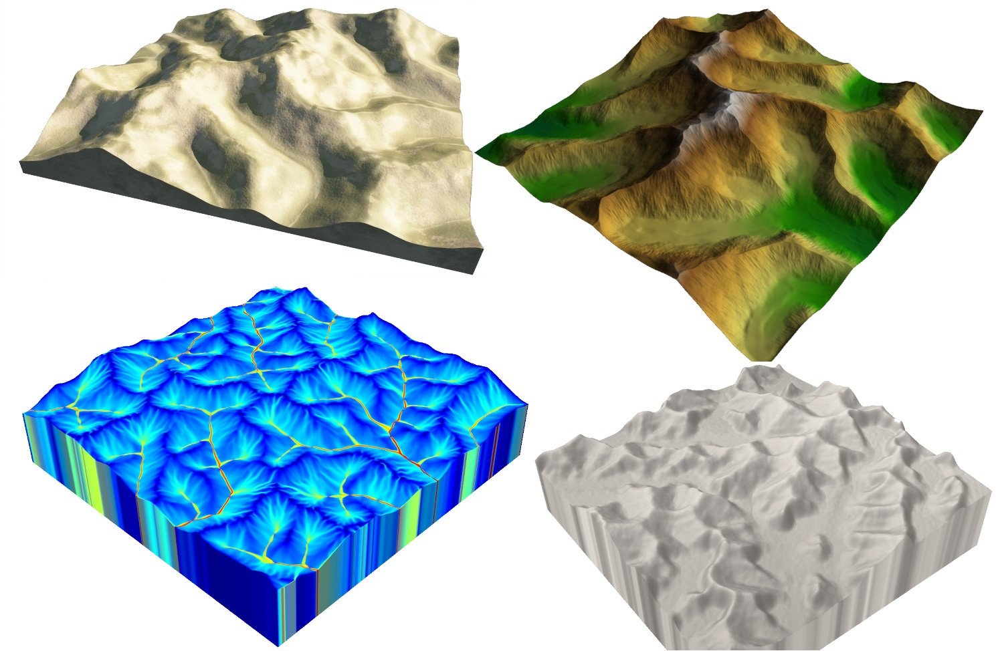

# Dendry: A Procedural Model for Dendritic Patterns
We introduce Dendry, a procedural function that generates dendritic patterns and is locally computable. The function is controlled by parameters such as the level of branching, the degree of local smoothing, random seeding and local disturbance parameters, and the range of the branching angles. It is also controlled by a global control function that defines the overall shape and can be used, for example, to initialize local minima. The algorithm returns the distance to a tree structure which is implicitly constructed on the fly, while requiring a small memory footprint. The evaluation can be performed in parallel for multiple points and scales linearly with the number of cores. We demonstrate an application of our model to the generation of terrain heighfields with consistent river networks. A quad core implementation of our algorithm takes aboutten seconds for a 512×512 resolution grid on the CPU.



## Please cite our work

> Mathieu Gaillard, Bedrich Benes, Eric Guérin, Eric Galin, Damien Rohmer, Marie-Paule Cani. Symposium on Interactive 3D Graphics and Games (I3D). 2019

```
@inproceedings{gaillard2019dendry,
 author = {Gaillard, Mathieu and Benes, Bedrich and Gu{\'e}rin, Eric and Galin, Eric and Rohmer, Damien and Cani, Marie-Paule},
 title = {Dendry: A Procedural Model for Dendritic Patterns},
 booktitle = {Proceedings of the ACM SIGGRAPH Symposium on Interactive 3D Graphics and Games},
 series = {I3D '19},
 year = {2019},
 isbn = {978-1-4503-6310-5},
 location = {Montreal, Quebec, Canada},
 pages = {16:1--16:9},
 articleno = {16},
 numpages = {9},
 doi = {10.1145/3306131.3317020},
 publisher = {ACM},
 address = {New York, NY, USA},
}
```

## Getting started

This Github repository contains the code developed for our paper. There are two distinct applications: a console application and an interactive designer. The console application contains the core of our algorithm. By executing it, you can reproduce the figures in the paper. The interactive designer is built on top of the console application and allows the user to change the parameters of the function, compute it and see the result interactively.

### Usage

A ZIP archive with a Release version is available for Windows 10 64 bits. To run the interactive designer, execute the file *InteractiveDesigner.exe*;

* Change the parameters on the right and refresh the view by clicking on *Noise > Render* (shortcut F5).
* You can save a heightmap in a 16 bits PNG by clicking on File > Save (shortcut Ctrl + S).
* If you need a software to visualize the heightmap in 3D, you can use [TerrainViewerWidget](https://github.com/mgaillard/TerrainViewerWidget "Go to the GitHub project TerrainViewerWidget")

### Prerequisites

- Visual Studio 2022
- Qt 6.2 LTS
- OpenCV 4.5.5

### Build on Windows

```Powershell
mkdir build && cd build
cmake -DCMAKE_PREFIX_PATH=C:/Code/opencv_455/build/;C:/Code/Qt/6.2.4/msvc2019_64 ..
```

### Build on Linux
```bash
$ mkdir build && cd build
$ cmake -DCMAKE_BUILD_TYPE=Release ../Noise
$ make
```

### Reproduce the examples from the paper
```bash
$ ./Noise
```

Note that:
- Image input files are located in the Image folder. You may need to move this folder to the build folder.
- Depending on the random generator implemented in your compiler, results may slightly change.

## Authors

- Mathieu Gaillard
- Bedrich Benes
- Eric Guérin
- Eric Galin
- Damien Rohmer
- Marie-Paule Cani

## License

See the LICENSE file.
